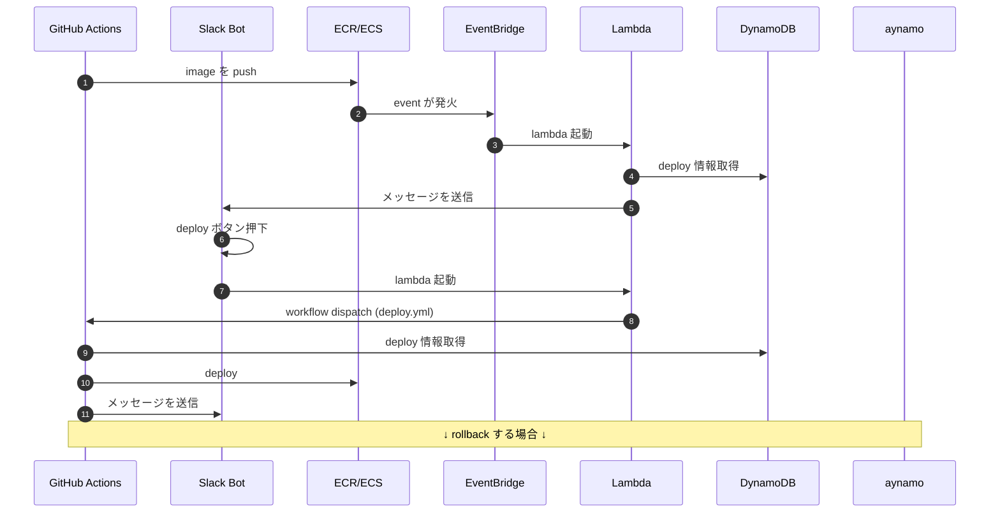

# ecs-deploy-with-slack-confirm
Slack での確認ボタンを経由する ECS-Deploy フローを構築する

```mermaid
sequenceDiagram
  participant action as GitHub Actions
  participant slack as Slack Bot
  participant ecs as ECR/ECS
  participant bridge as EventBridge
  participant lambda as Lambda

  participant dynamo as DynamoDB
  autonumber
  action->>ecs: image を push
  ecs->>bridge: event が発火
  bridge->>lambda: lambda 起動
  lambda->>dynamo: deploy 情報取得
  lambda->>slack: メッセージを送信
  slack->>slack: deploy ボタン押下
  slack->>lambda: lambda 起動
  lambda->>action: workflow dispatch (deploy.yml)
  action->>dynamo: deploy 情報取得
  action->>ecs: deploy
  action->>slack: メッセージを送信
  Note over action,aynamo: ↓ rollback する場合 ↓
```
